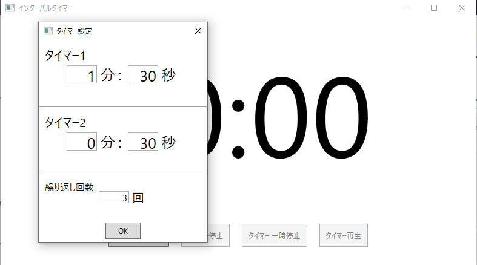

# このリポジトリは?

5分,10分,5分……というタイマーを繰り返すいわば**インターバルタイマー**!  
  
タイマーの設定時間や、繰り返し回数は自分で設定可能。  

今すぐダウンロードして試してみたい方は、下のリンクの**1.0.0.zip**というファイルをダウンロードしてください。  

[ここからダウンロード出来ます。](https://drive.google.com/drive/folders/1bnAqJ6lpzsDfgwjN-WlNqnfeaOiDJ1xe?usp=sharing)

# このリポジトリはビルド出来ません
このリポジトリには、素材の利用規約の関係上素材ファイルが含まれていません。(キャラクター画像、音楽ファイルなど)そのため、このプロジェクトをクローンしてビルドを行っても**正常に動作しません**。どのようなコードが書かれているのか参考にする目的でご使用ください。  

ソフトそのものを遊びたい方は、下のリンクからダウンロードしてください。

[ここからダウンロード出来ます。](https://drive.google.com/drive/folders/1bnAqJ6lpzsDfgwjN-WlNqnfeaOiDJ1xe?usp=sharing)

# ソースコードが入っているフォルダ
ここにソースコードが入っているフォルダの開き方を書きます。  
# マニュアル
ソフトのマニュアルは、[ここで]()公開しています。(現在作成中。)  
ソフトの使い方が分からない時は、ぜひご覧ください。

# ソフトに関する質問・意見
バグや不具合の報告は、以下のGoogleFormをお使い下さい。
ソフトウェアのバージョンは、ソフトウェアに同梱されているREADME.txtに書かれています。

[バグ・不具合報告](https://forms.gle/ngCaCjegDqKVT9gc6)  

それ以外の意見・感想は、下のGoogleFormから送ってください。  

[意見・感想](https://forms.gle/HAQido7dD4eZaUkc8)  

メールアドレスを明かしたくない場合は、このページからGitHubの機能を使ってイシューを送るか、私のTwitterへ連絡してください。  

Twitter:https://twitter.com/terapotan

# ライセンス
MITライセンスで配布しています。  
詳細は、[LICENSE](./LICENSE.txt)をご覧下さい。
# リリース名
1.0.0やprototypeなど、リリースにつけられる名前の意味については[こちら](./AboutVersion.md)をご覧ください。